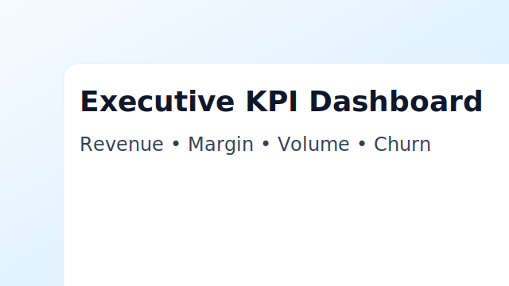

# Visual Pack v1 (Style A — Executive BI / Consulting Modern)

This pack enriches the site with consulting-grade visuals: dashboards, analytics charts, and architecture diagrams. It also adds a responsive gallery with a modal preview.

## What’s included
- `/assets/gallery/` — 15+ SVG images (+ thumbnails) you can ship on GitHub Pages.
- `gallery.css` — grid + card + modal styles that blend with your existing theme.
- `gallery.js` — dependency-free lightbox modal.
- Updated full pages (Option 1): `overview.html`, `projects.html`, `skills.html`.

## How to install
1. Copy **assets/gallery/**, **gallery.css**, **gallery.js** to your repo root.
2. Replace the three HTML files with the patched versions.
3. Commit & push to `main`. GitHub Pages will redeploy automatically.

## Paths / GitHub Pages
All asset links are **relative** (e.g., `assets/gallery/...`) so they work under project URLs like `https://username.github.io/repo/`.

## Accessibility
- All images include `alt` text.
- Modal supports keyboard (ESC to close).
- Keep color contrast AA+ where possible; update alt text to reflect your real content.

## Extending the gallery
Each card:
```html
<a class="gallery-card" href="#" data-full="assets/gallery/dashboard_exec.svg" data-title="Executive KPI Dashboard">
  
  <div class="meta"><p class="title">Executive KPI Dashboard</p><p class="desc">Revenue • Margin • Volume • Churn</p></div>
</a>
```
Duplicate a card, change `data-full`, `src`, title/desc. Keep images in `/assets/gallery/`.

## Local testing
Use a local server (e.g., `python3 -m http.server 5500`) because browsers block `fetch()` from `file://`.
